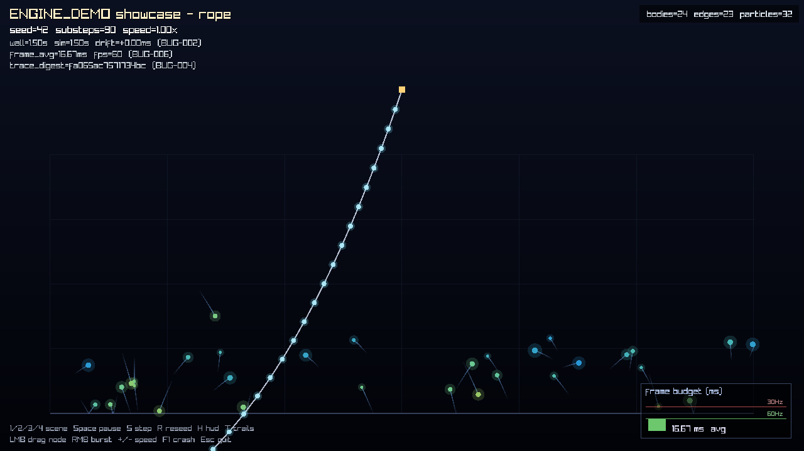
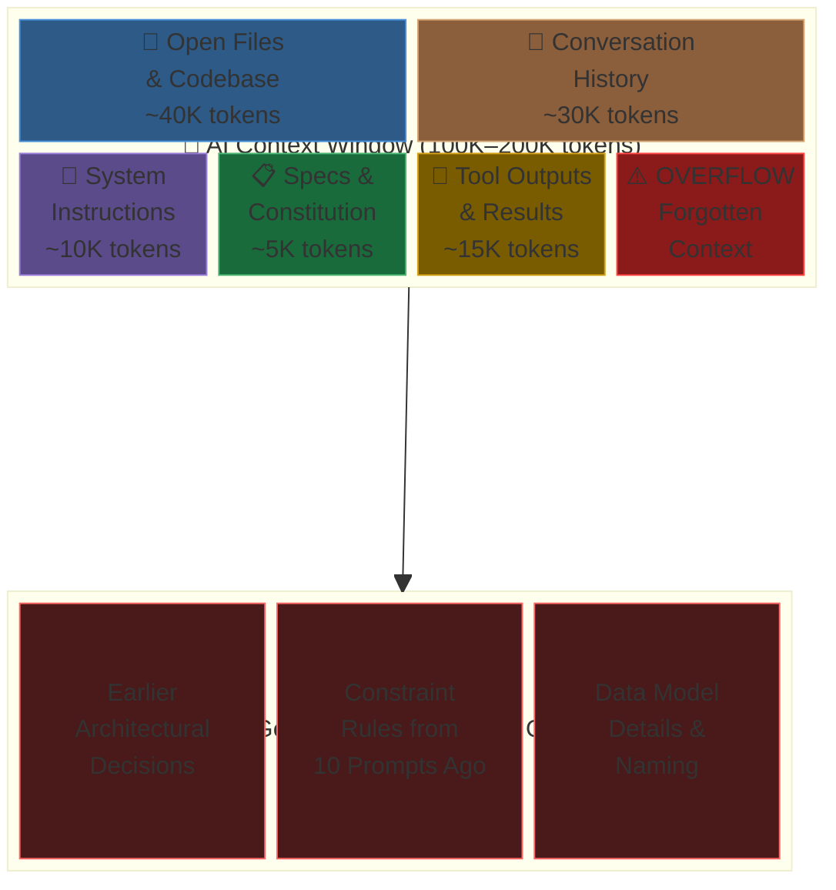

# GitHub Copilot Spec-Kit: Comprehensive Workshop Training

> **Workshop Series** | EA × Insight Copilot Workshop
> **Audience:** Intermediate developers new to specification-driven AI development
> **Prerequisites:** GitHub Copilot subscription (Pro+ or Enterprise), VS Code with Copilot extension, basic familiarity with version control
> **Total Duration:** 3 sessions × 90 minutes each
> **Format:** Demo-first — watch experts use Spec-Kit live, then learn the concepts behind it

---

## Table of Contents

- [Part 0: Live Demo — Spec-Kit in Action](#part-0-live-demo--spec-kit-in-action)
  - [0.1 What You're About to See](#01-what-youre-about-to-see)
  - [0.2 Demo Setup](#02-demo-setup)
  - [0.3 Demo Step 1: Ground the Constitution](#03-demo-step-1-ground-the-constitution)
  - [0.4 Demo Step 2: Generate the Specification](#04-demo-step-2-generate-the-specification)
  - [0.5 Demo Step 3: Produce the Architecture Plan](#05-demo-step-3-produce-the-architecture-plan)
  - [0.6 Demo Step 4: Decompose into Tasks](#06-demo-step-4-decompose-into-tasks)
  - [0.7 Demo Step 5: Implement with Human Review](#07-demo-step-5-implement-with-human-review)
  - [0.8 What Just Happened?](#08-what-just-happened)
- [Part 1: Foundations — What is Spec-Kit?](#part-1-foundations--what-is-spec-kit)
  - [1.1 The Problem Spec-Kit Solves](#11-the-problem-spec-kit-solves)
  - [1.1a The Why and the Tradeoffs](#11a-the-why-and-the-tradeoffs)
  - [1.1b Context Windows and Hallucination Mitigation](#11b-context-windows-and-hallucination-mitigation)
  - [1.2 The Five-Stage Spec-Kit Flow](#12-the-five-stage-spec-kit-flow)
  - [1.3 Core Principles](#13-core-principles)
  - [1.3a Top 10 Best Practices for Spec-Driven Copilot Workflows](#13a-top-10-best-practices-for-spec-driven-copilot-workflows)
  - [1.4 GitHub Copilot Ecosystem Integration](#14-github-copilot-ecosystem-integration)
  - [1.5 Copilot Custom Instructions Architecture](#15-copilot-custom-instructions-architecture)
  - [1.6 GitHub Copilot CLI — The Terminal Agent](#16-github-copilot-cli--the-terminal-agent)
  - [1.7 The Reference Project: engine_demo](#17-the-reference-project-engine_demo)
- [Part 2: Hands-On Practice — Adding More Features](#part-2-hands-on-practice--adding-more-features)
  - [2.1 Session Overview](#21-session-overview)
  - [2.2 Rejection and Re-Specification Flow](#22-rejection-and-re-specification-flow)
  - [2.3 Feature 2: Lockless Ring Buffer (Condensed)](#23-feature-2-lockless-ring-buffer-condensed)
  - [2.4 Feature 3: Fixed String (Condensed)](#24-feature-3-fixed-string-condensed)
  - [2.5 Reflection and Key Takeaways](#25-reflection-and-key-takeaways)
- [Part 3: Use Case — Designing a New Game from an Existing Foundation](#part-3-use-case--designing-a-new-game-from-an-existing-foundation)
  - [3.1 Session Overview](#31-session-overview)
  - [3.2 Analyzing the Existing Engine](#32-analyzing-the-existing-engine)
  - [3.3 Writing a New Constitution](#33-writing-a-new-constitution)
  - [3.4 /specify — New Game Features](#34-specify--new-game-features)
  - [3.5 /plan — Mapping Foundation to New Architecture](#35-plan--mapping-foundation-to-new-architecture)
  - [3.6 /tasks — Delta Decomposition](#36-tasks--delta-decomposition)
  - [3.7 /implement — Building on the Foundation](#37-implement--building-on-the-foundation)
  - [3.8 How Spec-Kit Prevents Scope Creep](#38-how-spec-kit-prevents-scope-creep)
  - [3.9 Reflection and Key Takeaways](#39-reflection-and-key-takeaways)
- [Part 4: Use Case — Cross-Language Game Transformation](#part-4-use-case--cross-language-game-transformation)
  - [4.1 Session Overview](#41-session-overview)
  - [4.2 Phase A: Reverse-Specification](#42-phase-a-reverse-specification)
  - [4.3 Phase B: Target Constitution (Rust/Bevy)](#43-phase-b-target-constitution-rustbevy)
  - [4.4 Phase C: Transformation Plan](#44-phase-c-transformation-plan)
  - [4.5 Phase D: Tasks and Implementation](#45-phase-d-tasks-and-implementation)
  - [4.6 Copilot CLI Scenario: Terminal-Driven Transformation](#46-copilot-cli-scenario-terminal-driven-transformation)
  - [4.7 Best Practices for Cross-Language Transformation](#47-best-practices-for-cross-language-transformation)
  - [4.8 Reflection and Key Takeaways](#48-reflection-and-key-takeaways)
- [Appendix A: Spec-Kit Quick Reference Card](#appendix-a-spec-kit-quick-reference-card)
- [Appendix B: Copilot CLI Command Reference](#appendix-b-copilot-cli-command-reference)
- [Appendix C: Custom Instructions File Templates](#appendix-c-custom-instructions-file-templates)

---

## Part 0: Live Demo — Spec-Kit in Action

### 0.1 What You're About to See

You're about to watch an expert drive GitHub Copilot through a complete feature build — from a blank problem statement to compiled, tested C++ code — in under 20 minutes. No slides. No theory. Just Spec-Kit doing what it does: converting vague intent into governed, reviewable, working software.

**The scenario:** We're adding a **Particle VFX Subsystem** to an existing C++20 game engine. This is a real subsystem with real constraints — no heap allocation in hot loops, deterministic behavior, explicit allocators, full test coverage. Watch how Spec-Kit ensures every line of generated code respects those rules.

**The game engine you'll be working with:**



_The `engine_demo` physics sandbox: a C++20 engine with EASTL containers, constraint-based physics, and a real-time frame budget system. This is the codebase we'll be extending with Spec-Kit._

**What to watch for:**

- How a 5-sentence problem statement becomes a formal specification with measurable acceptance criteria
- How the AI generates architecture that's _constrained_ by binding rules (not hallucinated)
- How tasks are right-sized for human review (≤ 150 lines each)
- How the first implementation compiles and passes tests on the first try — because the spec was precise

**The demo flow at a glance:**


_Each arrow is a Human-In-The-Loop (HITL) gate — the demo pauses for approval before advancing. This is the core discipline that makes AI-generated code governable._

> **Command naming:** this workspace installs the Spec-Kit prompts under the `speckit.` prefix.
> Wherever this document says `/constitution`, `/specify`, `/plan`, `/tasks`, or `/implement`
> as a stage name, the actual command you type in Copilot Chat is `/speckit.constitution`,
> `/speckit.specify`, `/speckit.plan`, `/speckit.tasks`, or `/speckit.implement`.
> (The GitHub Copilot **CLI**'s `/plan` command in §1.6 and Appendix B is a different,
> CLI-native feature and keeps its short name.)

<!-- markdownlint-disable-next-line MD028 -->

> **Facilitator says:** "Don't worry about understanding every concept yet. Just watch. We'll unpack the WHY in Part 1. Right now, absorb the WHAT."

---

### 0.2 Demo Setup

| Requirement                                            | Status                |
| ------------------------------------------------------ | --------------------- |
| `speckit-workshop-demo` repository cloned and building | `ctest` green ✅      |
| VS Code with Copilot Chat (Agent Mode enabled)         | Connected ✅          |
| `specs/constitution.md` open in editor                 | 8 articles visible ✅ |
| `AGENTS.md` open in editor                             | Hard rules visible ✅ |
| Fallback branch available (`git branch -a`)            | `demo-fallback` ✅    |

> **Stage insurance:** if live generation stalls mid-demo, `git checkout demo-fallback`
> contains the completed `specs/particle-vfx/` artifacts and the implemented, tested
> subsystem — you can jump to any step's finished state instantly.

**Build verification (run this before demo starts):**

```bash
cmake --preset default-debug
cmake --build --preset default-debug
ctest --preset default-debug --output-on-failure
```

> **Facilitator says:** "Everything's green. Now watch what happens when we feed a problem to Spec-Kit."

---

### 0.3 Demo Step 1: Ground the Constitution

> **⏱ ~2 minutes**

**What you'll see:** Before writing ANY specification, we ground ourselves in the existing rules. The constitution is not a guideline — it's a **binding contract** that gates everything downstream.

**Action:** Open `specs/constitution.md` and scan the 8 articles that will constrain our particle system.

For the **Particle VFX Subsystem**, the relevant constraints are:

| Article                  | What It Means for Our Feature                                   |
| ------------------------ | --------------------------------------------------------------- |
| Art. 1 — No exceptions   | Allocation failures return status enums, never throw            |
| Art. 2 — No RTTI         | No `dynamic_cast`; use tagged enums for particle types          |
| Art. 3 — EASTL-first     | `eastl::vector` with explicit allocator, never `std::vector`    |
| Art. 4 — Allocator-aware | Emitter constructor takes `engine_demo::allocator&`             |
| Art. 5 — Determinism     | Seeded RNG; positions reproducible across runs                  |
| Art. 6 — Real-time       | **Critical**: Zero allocation in emit/update loop; pre-allocate |
| Art. 7 — Test-first      | GTest for every public function                                 |
| Art. 8 — HITL gates      | Human approval between every stage                              |

> **Facilitator says:** "These 8 rules are the guardrails. Every single thing Copilot generates must satisfy ALL of them. Watch how this shapes every downstream decision."

---

### 0.4 Demo Step 2: Generate the Specification

> **⏱ ~5 minutes**

**What you'll see:** A natural-language problem statement goes in. A fully-formed specification with data models, behavioral contracts, and measurable acceptance criteria comes out — all grounded in the constitution.

**Prompt to Copilot:**

```text
/speckit.specify

Create a specification for a Particle VFX Subsystem for engine_demo.

Context:
- This is a C++20 game engine with EASTL containers, no exceptions, no RTTI
- See specs/constitution.md for binding constraints (articles 1-8)
- The subsystem provides visual effects (sparks, dust, explosions) for the physics sandbox
- Must integrate with the existing ECS World (ecs/world.h) and fixed-step game loop (sim/game_loop.h)
- Particles are purely visual — they do NOT participate in physics constraint solving

Requirements:
- Pooled particle storage with fixed capacity set at construction
- Multiple emitter types (point, cone, sphere) as a tagged enum
- Per-particle: position, velocity, lifetime, color, size
- Force applicators (gravity, wind, turbulence) composable per-emitter
- Deterministic spawning from seeded RNG for replay consistency
- Zero allocation in the update/emit hot path (Article 6)
- Interop with the existing frame budget system for timing

Acceptance Criteria:
- Pool exhaustion returns a status enum (not exception)
- Emitter can be ticked independently of the physics solver
- 500 simultaneous particles maintain < 2ms per frame at 60 FPS
- All public functions have GTest coverage
- Deterministic: same seed + same frame sequence = identical particle state
```

**Watch Copilot produce `specs/particle-vfx/spec.md`:**

The output includes:

- **§1 Purpose** — one-paragraph scope statement
- **§2 Scope** — explicit in/out boundaries (no GPU rendering, no particle collisions)
- **§3 Constitutional Constraints** — table showing how EACH article is addressed
- **§4 Data Model** — concrete `struct particle` (32-byte aligned), `enum class emitter_shape`, `enum class emit_status`
- **§5 Behavioral Contracts** — emitter lifecycle, force application protocol, determinism guarantee
- **§6 Performance Budget** — 500 particles < 2ms, emit(100) < 0.1ms, ≤ 24KB memory per emitter
- **§7 Test Plan** — 6 named tests with what each validates

> **Facilitator says:** "Notice what just happened. A vague 'add particle effects' became a 7-section document with checkable criteria. The AI can't hallucinate its way past 'pool exhaustion returns pool_exhausted enum' — that's falsifiable. Let's approve it and move on."

**🚨 HITL GATE:** Review the spec. All 8 articles addressed? Acceptance criteria measurable? Scope boundaries clear?

✅ **Approve** → proceed to `/speckit.plan`

---

### 0.5 Demo Step 3: Produce the Architecture Plan

> **⏱ ~5 minutes**

**What you'll see:** The spec (WHAT) becomes an architecture plan (HOW). File layout, memory decisions, algorithms, test ordering, and task sizing — all derived from the specification.

**Prompt to Copilot:**

```text
/speckit.plan

Based on specs/particle-vfx/spec.md and specs/constitution.md, produce an implementation
plan for the Particle VFX Subsystem.

Requirements for the plan:
- File layout (which headers, which .cpp files, where in the directory tree)
- Memory layout decisions (pool structure, alignment)
- Algorithm choices for emit/tick/recycle
- Test-first ordering (what gets tested before what)
- Integration points with existing subsystems (ECS world, game loop, frame budget)
- Estimated task count and sizing (each task < 150 lines of diff)
```

**Watch Copilot produce the plan with:**

- **File Layout** — `include/engine_demo/vfx/particle.h`, `emitter.h`, `forces.h` + matching `.cpp` + test file
- **Memory Layout** — flat `eastl::vector<particle>` (cache-friendly) + free-list index stack. Explains WHY: "~4× faster than pointer-chasing a linked list at 500 particles"
- **Algorithm: tick()** — zero-allocation loop advancing particles, recycling dead slots
- **Algorithm: emit()** — pop from free-list, spawn with seeded RNG
- **Test-First Ordering** — creation → exhaustion → lifetime → determinism → force composition → zero-allocation assertion
- **Task Decomposition** — 5 tasks, largest is 120 lines

> **Facilitator says:** "Look at the memory layout decision. It chose a flat array over a linked list and EXPLAINS WHY — cache locality, Article 6 compliance. This isn't random code generation. It's architecture reasoning backed by the constitution."

**🚨 HITL GATE:** Plan review.

- Memory layout satisfies Article 6 (real-time)? ✅ Flat array, pre-allocated pool
- Test ordering satisfies Article 7 (test-first)? ✅ Tests before force implementation
- Each task < 150 lines? ✅ Largest is 120 lines

✅ **Approve** → proceed to `/speckit.tasks`

---

### 0.6 Demo Step 4: Decompose into Tasks

> **⏱ ~3 minutes**

**What you'll see:** The plan becomes a prioritized list of discrete, reviewable work items. Each task has explicit files, deliverables, and acceptance gates.

**Prompt to Copilot:**

```text
/speckit.tasks

Decompose specs/particle-vfx/plan.md into implementable tasks. Each task must:
- Be < 150 lines of diff
- Include the test BEFORE or WITH the implementation (Article 7)
- State which files are created or modified
- State the acceptance gate (what must be true for the task to be approved)
```

**Watch Copilot produce 5 tasks:**

| #   | Task                                                  | Lines | Key Gate                                       |
| --- | ----------------------------------------------------- | ----- | ---------------------------------------------- |
| 1   | Data types header (`particle.h`)                      | ~60   | `static_assert(sizeof(particle) == 32)` passes |
| 2   | Emitter core: constructor + tick + emit               | ~120  | Zero allocations in tick/emit                  |
| 3   | Core tests (4 GTest cases)                            | ~100  | All 4 pass with `ctest`                        |
| 4   | Force system: gravity, wind, turbulence               | ~80   | Deterministic turbulence given same seed       |
| 5   | Integration test: force composition + zero-allocation | ~60   | All 6 tests green                              |

> **Facilitator says:** "Five tasks. The largest is 120 lines. A human can review each one in under 5 minutes. Compare that to a single 'add particle system' prompt producing 600+ lines in one shot that nobody can review."

**🚨 HITL GATE:** Task sizing review. Dependencies ordered correctly? Test-first maintained?

✅ **Approve** → proceed to `/speckit.implement`

---

### 0.7 Demo Step 5: Implement with Human Review

> **⏱ ~5 minutes**

**What you'll see:** Copilot generates code for ONE task. We review the diff, verify it compiles, and approve it. This is the HITL gate in action.

**Prompt to Copilot:**

```text
/speckit.implement task 1

Implement the particle data types header as specified in specs/particle-vfx/tasks.md Task 1.
File: include/engine_demo/vfx/particle.h

Constraints (from constitution):
- No #include of std:: headers except <cstdint>, <cstddef>
- No exceptions, no RTTI
- 32-byte aligned particle struct
- All enums are `enum class` with explicit underlying type
```

**Watch Copilot produce `include/engine_demo/vfx/particle.h`:**

```cpp
#pragma once

#include <cstdint>
#include <cstddef>
#include <engine_demo/allocator.h>

namespace engine_demo::vfx {

/// Per-particle visual state. 32-byte aligned for cache-line efficiency.
struct alignas(32) particle {
    float   position[2];         // x, y
    float   velocity[2];         // vx, vy
    float   lifetime_remaining;  // seconds; dead when <= 0
    uint8_t color[4];            // RGBA
    float   size;
    uint8_t _pad[4];             // pad to 32 bytes
};
static_assert(sizeof(particle) == 32, "particle must be exactly 32 bytes");

/// Emitter shape discrimination (Article 2: no RTTI, use enum)
enum class emitter_shape : uint8_t { point, cone, sphere };

/// Status returned by emit operations (Article 1: no exceptions)
enum class emit_status : uint8_t { ok, pool_exhausted, lifetime_expired };

/// Configuration for emitter construction
struct emitter_config {
    emitter_shape   shape;
    uint32_t        max_particles;
    float           emit_rate;          // particles per second
    float           particle_lifetime;  // seconds
    float           origin[2];          // x, y
    float           spread_angle;       // radians (cone shape only)
    float           radius;             // sphere shape only
    uint64_t        seed;               // RNG seed for determinism (Article 5)
};

} // namespace engine_demo::vfx
```

**HITL Review Checklist:**

- [x] No `std::` includes beyond allowed subset
- [x] `static_assert(sizeof(particle) == 32)` present
- [x] `enum class` with explicit underlying type
- [x] No default constructors
- [x] Compiles with `-fno-exceptions -fno-rtti`

**Run the build:**

```bash
cmake --build --preset default-debug
# ✅ Compiles clean
```

> **Facilitator says:** "60 lines. Clean compile. Every constitutional article respected. Task 1 done. We'd commit this, then proceed to Task 2. Each subsequent task follows the same cycle: prompt → generate → review → approve/reject."

✅ **Task 1 Approved** → commit and proceed

---

### 0.8 What Just Happened?

You just watched Spec-Kit drive a feature from idea to working code in 5 stages:

```text
┌─────────────┐    ┌──────────┐    ┌────────┐    ┌────────┐    ┌─────────────┐
│/constitution│───▶│ /specify  │───▶│ /plan  │───▶│ /tasks │───▶│ /implement  │
└─────────────┘    └──────────┘    └────────┘    └────────┘    └─────────────┘
       │                 │               │              │               │
    Binding          Formal         Architecture     Right-sized      Code +
    rules            spec with      decisions +      work items       tests
                     acceptance     memory layout    (≤150 lines)
                     criteria
```

**What made this different from "just asking Copilot to code something":**

| Without Spec-Kit                                      | With Spec-Kit (what you just saw)                    |
| ----------------------------------------------------- | ---------------------------------------------------- |
| "Add a particle system" → 600+ line monolithic diff   | 5 tasks × ~80 lines = reviewed, tested increments    |
| Copilot might use `std::vector` (violating Article 3) | Constitution caught at spec stage, never generated   |
| No performance guarantee                              | Spec mandates < 2ms/500 particles — falsifiable      |
| No way to know if output matches intent               | Acceptance criteria are checkable yes/no             |
| Rollback means deleting everything                    | Rollback means fixing ONE spec line and regenerating |

**The key insight:** Specifications constrain generation. The tighter the spec, the less room for hallucination. You just saw zero constitutional violations because the AI had no room to violate them — the constraints were explicit, measurable, and gated by human review at every transition.

> **Up next in Part 1:** We'll unpack the principles behind what you just watched — WHY this works, how context windows and hallucination mitigation make specifications essential, and the full Copilot ecosystem that powers the workflow.

---

## Part 1: Foundations — What is Spec-Kit?

> Now that you've seen Spec-Kit in action, let's unpack the methodology, principles, and tooling behind what you observed.

### 1.1 The Problem Spec-Kit Solves

Modern AI coding assistants can generate code at remarkable speed, but without discipline they produce:

- **Drift** — code that gradually diverges from architectural intent
- **Compounding errors** — a vague requirement at the start cascades into dozens of bugs downstream
- **Ungovernable output** — no human can review a 2000-line PR generated in one shot

**Spec-Kit** is a methodology for specification-driven AI development. It structures the interaction between a human architect and an AI coding agent into five discrete, reviewable stages — each with a human approval gate. The result is code that is:

1. **Traceable** — every line connects back to a specification
2. **Reviewable** — diffs are right-sized (< 150 lines) and contextual
3. **Deterministic** — the same spec produces consistent output
4. **Recoverable** — when something goes wrong, you roll back to the spec (not the code)

### 1.1a The Why and the Tradeoffs

#### Pros

| Benefit                     | How Spec-Kit Delivers It                                                                                 |
| --------------------------- | -------------------------------------------------------------------------------------------------------- |
| **Focused output**          | Each `/implement` task targets a single concern with explicit acceptance criteria — no meandering code   |
| **Architectural alignment** | The constitution binds every stage; drift is structurally impossible if gates are respected              |
| **Reviewability**           | Right-sized diffs (≤ 150 lines) mean a human can actually read and reason about every change             |
| **Onboarding ramp**         | New team members read the spec and constitution to understand _why_ code exists, not just _what_ it does |
| **Deterministic outcomes**  | The same spec + constitution produces consistent output across different sessions and developers         |
| **Cheap rollback**          | When something is wrong, you fix the spec (cheap) not the code (expensive)                               |

#### Cons

| Cost                           | Mitigation                                                                                                                                         |
| ------------------------------ | -------------------------------------------------------------------------------------------------------------------------------------------------- |
| **Upfront time investment**    | Writing a spec takes 10-20 min. But a single vague prompt followed by 2 hours of debugging costs more. The ROI is 3-5× on any feature > 100 lines. |
| **Learning curve**             | The five-stage flow takes 2-3 repetitions to internalize. Part 2's hands-on features provide that practice.                                        |
| **Overhead for trivial tasks** | A 20-line bug fix doesn't need five stages. Scale the methodology to the task.                                                                     |
| **Discipline fatigue**         | HITL gates feel slow. That friction is intentional — it catches errors when they're cheapest to fix.                                               |

#### When NOT to Use Full Spec-Kit

Not every task needs all five stages. The methodology scales:

- **One-off scripts (< 50 lines):** Skip to `/implement` with a one-sentence prompt
- **Exploratory prototypes:** Use `/specify` loosely — skip the constitution check
- **Well-understood bug fixes:** A failing test IS the spec; go straight to `/implement`
- **Multi-system features (> 500 lines):** Use the full five-stage flow — this is where Spec-Kit pays dividends

> **Rule of thumb:** If a feature would produce a PR you'd struggle to review in one sitting, it needs Spec-Kit.

### 1.1b Context Windows and Hallucination Mitigation

#### The Context Window Problem

AI coding agents operate within a **context window** — a finite token budget (typically 100K-200K tokens) that represents their working memory. Every file, conversation turn, and instruction competes for space in that window. When context overflows:

- The AI "forgets" earlier instructions and constraints
- Output quality degrades as architectural decisions made 10 prompts ago fade from memory
- The AI confabulates — filling knowledge gaps with plausible-sounding but incorrect code



_The context window is a zero-sum game. As open files, conversation history, and tool outputs grow, earlier architectural decisions and constraints get pushed out — leading to drift, hallucination, and inconsistency._

#### How Specs Manage Context

Spec-Kit solves context management structurally:

| Mechanism                       | How It Helps                                                                                                                     |
| ------------------------------- | -------------------------------------------------------------------------------------------------------------------------------- |
| **Constitution as anchor**      | A short, high-signal document (< 500 tokens) that stays in context and prevents architectural drift                              |
| **Stage isolation**             | Each `/implement` task carries ONLY its task description + spec reference — not the entire codebase history                      |
| **Markdown as source of truth** | The `.md` plan file is a persistent, external memory — the AI re-reads it each stage rather than relying on conversation history |
| **Right-sized tasks**           | Small tasks complete within a single context window — no multi-turn degradation                                                  |

#### How Specs Mitigate Hallucination

AI hallucination occurs when the model generates plausible but incorrect output because it lacks grounding constraints. Specifications provide that grounding:.

1. **Verifiable assertions** — Acceptance criteria like "returns `pool_exhausted` when capacity is exceeded" are checkable. The AI cannot fabricate its way past a failing test.
2. **Constitutional constraints** — Hard rules ("no `std::` containers") give the AI clear boundaries. Violations are immediately detectable at review.
3. **Concrete data models** — When the spec defines `struct particle { float position[2]; ... }`, the AI has no room to hallucinate an incompatible structure.
4. **Measurable performance budgets** — "< 2ms for 500 particles" is a falsifiable claim. The AI must produce code that actually meets it.

> **Key insight:** Specs convert open-ended generation ("add a particle system") into constrained completion ("implement this exact API with these exact guarantees"). Constrained completion hallucinates far less than open-ended generation.

#### Many Approaches to Planning

There is no single "correct" plan shape. The approach depends on the task:

- **Greenfield feature** → Full 5-stage flow (constitution → specify → plan → tasks → implement)
- **Extending existing system** → Start at `/specify` with existing code as context anchor
- **Bug fix with repro** → The failing test IS the spec; jump to `/implement`
- **Cross-cutting refactor** → Heavy `/plan` stage with module mapping; lighter `/specify`
- **Cross-language port** → Reverse-spec first (extract WHAT from source), then forward-implement in target

The methodology provides the stages. Professional judgment decides which stages a given task needs.

### 1.2 The Five-Stage Spec-Kit Flow

```text
┌─────────────┐    ┌──────────┐    ┌────────┐    ┌────────┐    ┌─────────────┐
│ /constitution│───▶│ /specify │───▶│ /plan  │───▶│ /tasks │───▶│ /implement  │
└─────────────┘    └──────────┘    └────────┘    └────────┘    └─────────────┘
       │                 │               │              │               │
       ▼                 ▼               ▼              ▼               ▼
  [Ground Truth]   [Requirements]  [Architecture]  [Work Items]   [Code + Tests]
                                        │              │               │
                                   ┌────┴────┐    ┌────┴────┐    ┌────┴────┐
                                   │HITL GATE│    │HITL GATE│    │HITL GATE│
                                   └─────────┘    └─────────┘    └─────────┘
```

| Stage                   | Input                            | Output                                                      | Gate                                                        |
| ----------------------- | -------------------------------- | ----------------------------------------------------------- | ----------------------------------------------------------- |
| `/speckit.constitution` | Project values, hard constraints | Binding articles document                                   | Human reads aloud, confirms                                 |
| `/speckit.specify`      | Problem statement + constitution | Formal specification (`spec.md`)                            | Human reviews acceptance criteria                           |
| `/speckit.plan`         | Specification + constitution     | Architecture decisions, data structures, test strategy      | **HITL: Human approves before decomposition**               |
| `/speckit.tasks`        | Plan + constitution              | Ordered list of implementable work items (< 150 lines each) | **HITL: Human approves sizing**                             |
| `/speckit.implement`    | One task at a time               | Code diff + test                                            | **HITL: Human reads diff, runs ctest, approves or rejects** |

### 1.3 Core Principles

#### The Compounding-Error Principle

> Errors introduced early in the spec cascade exponentially downstream.

A vague word in `/specify` becomes an ambiguous architecture choice in `/plan`, which becomes 3 wrong tasks in `/tasks`, which becomes 15 broken lines in `/implement`. **Fix errors at the earliest possible stage.**

#### Human-In-The-Loop (HITL)

Every stage transition requires human approval. This is not a suggestion — it is the methodology. The friction is the feature. HITL gates:

- Catch misunderstandings before code is written
- Maintain architectural coherence across features
- Ensure the AI's interpretation matches the human's intent
- Provide natural checkpoints for rollback

#### Stage Roll-Back Discipline

> If a task is rejected 3× in a row, the **spec** is wrong — not the code.

When implementation repeatedly fails to satisfy intent, the problem is upstream:

1. First rejection → re-prompt with clearer acceptance criteria
2. Second rejection → examine the plan for misaligned architecture
3. Third rejection → **roll back to `/specify`** and tighten the specification

#### Right-Sizing

Tasks must produce diffs of **≤ 150 lines**. Larger tasks are rejected and split. This ensures:

- Every diff is humanly reviewable in < 5 minutes
- Test coverage is granular and meaningful
- Rollback cost is low (one small commit, not a monolithic PR)

### 1.3a Top 10 Best Practices for Spec-Driven Copilot Workflows

These practices distill the Spec-Kit methodology into actionable habits. Each maps directly to a stage or principle covered in this workshop.

| #   | Practice                        | What It Means                                                                                                                                                                  | Where Demonstrated                    |
| --- | ------------------------------- | ------------------------------------------------------------------------------------------------------------------------------------------------------------------------------ | ------------------------------------- |
| 1   | **Define Clear Objectives**     | State the exact goal before writing any code. Use `/speckit.specify` with measurable acceptance criteria — not "make it fast" but "< 2ms for 500 particles at 60 FPS."         | §0.4 `/specify` demo                  |
| 2   | **Modularize the Plan**         | Break work into small, digestible chunks. Every task produces a diff of ≤ 150 lines — right-sized for human review and cheap to roll back.                                     | §0.6 `/tasks` decomposition           |
| 3   | **Establish Constraints**       | Explicitly state performance, stylistic, or architectural boundaries. The `/speckit.constitution` stage encodes these as binding articles that gate every downstream decision. | §0.3 constitution grounding           |
| 4   | **Draft a Markdown Plan**       | Always maintain a central `.md` file as the source of truth. The `spec.md`, `plan.md`, and `tasks.md` files ARE the project memory — persistent, versionable, diffable.        | §0.4–0.6 spec/plan/tasks outputs      |
| 5   | **Iterate on the Spec**         | Review and refine the plan with Copilot before executing it. Stage roll-back discipline: if implementation fails 3×, the spec is wrong — fix upstream.                         | §2.2 Rejection flow                   |
| 6   | **Provide Contextual Anchors**  | Point Copilot to relevant existing files or APIs. Use `copilot-instructions.md`, `.instructions.md` files, and explicit file references in prompts to keep the AI grounded.    | §1.5 Custom instructions architecture |
| 7   | **Sequential Execution**        | Have the agent tackle one stage at a time. `/speckit.implement` runs one task, pauses for review, then proceeds. Never batch multiple tasks into a single generation.          | §0.7 `/implement` with HITL           |
| 8   | **Implement Strict Guardrails** | Define what the AI should not touch or modify. `AGENTS.md` declares hard rules; `--deny-tool` in CLI prevents dangerous operations. The AI knows its boundaries.               | §1.5 AGENTS.md; Appendix B CLI flags  |
| 9   | **Test-Driven Prompts**         | Include unit testing requirements within the spec itself. Every spec has a §Test Plan; every task has acceptance gates that include running tests.                             | §0.4 spec §7 Test Plan                |
| 10  | **Human-in-the-Loop Review**    | Validate each completed stage before moving to the next. HITL gates between every stage transition are non-negotiable — the friction catches errors at their cheapest.         | §1.3 HITL principle; every stage gate |

#### Applying the Top 10 in Practice

**Before coding:** Practices 1, 3, 4 (define objectives, constraints, and plan document)
**During planning:** Practices 2, 5, 6 (modularize, iterate, anchor context)
**During execution:** Practices 7, 8, 9 (sequential, guardrails, test-driven)
**At every transition:** Practice 10 (human review)

> **The workflow in one sentence:** Write a markdown plan (4) with clear objectives (1) and constraints (3), iterate on it (5) with contextual anchors (6), then release the agent to execute sequentially (7) within guardrails (8), testing at every step (9), with human approval at every gate (10), in right-sized chunks (2).

### 1.4 GitHub Copilot Ecosystem Integration

Spec-Kit leverages multiple GitHub Copilot surfaces:

| Surface                    | Role in Spec-Kit                                                                                                                                     |
| -------------------------- | ---------------------------------------------------------------------------------------------------------------------------------------------------- |
| **Copilot Chat (VS Code)** | Primary interface for `/specify`, `/plan`, `/tasks`, `/implement` stages. Agent mode with workspace context.                                         |
| **Copilot Cloud Agent**    | Autonomous task execution from GitHub Issues. Respects `AGENTS.md` and `copilot-instructions.md`. Creates PRs for HITL review.                       |
| **Copilot CLI**            | Terminal-based agentic interface. Plan mode for architecture analysis. Programmatic mode for scripted spec generation.                               |
| **Custom Instructions**    | `.github/copilot-instructions.md` encodes the constitution. `AGENTS.md` enforces hard rules. `.instructions.md` files target specific file types.    |
| **MCP Servers**            | Extend Copilot with external tools (linters, build systems, test runners) for validation during `/implement`.                                        |
| **Prompt Files**           | `.prompt.md` files encode reusable spec-kit workflows as parameterized templates.                                                                    |
| **Custom Agents**          | Specialized personas (this repo ships the `speckit.*.agent.md` stage agents in `.github/agents/`) for spec validation, planning, and implementation. |

### 1.5 Copilot Custom Instructions Architecture

The custom instructions hierarchy enforces constitutional rules at every level:

```text
Repository Root
├── .github/
│   ├── copilot-instructions.md        ← Repository-wide rules (applies to ALL Copilot interactions)
│   ├── instructions/
│   │   ├── cpp-impl.instructions.md   ← Applies to src/**/*.cpp, include/**/*.h
│   │   └── tests.instructions.md      ← Applies to **/test_*.cpp
│   ├── prompts/
│   │   └── speckit.*.prompt.md        ← The /speckit.* slash commands
│   └── agents/
│       └── speckit.*.agent.md         ← Spec-Kit stage agents
├── AGENTS.md                          ← Agent-level hard rules (Cloud Agent + CLI)
├── .specify/
│   └── memory/constitution.md         ← Machine-readable constitution (read by /speckit.*)
├── specs/
│   └── constitution.md                ← The Spec-Kit ground truth (human-facing)
└── src/
    └── ...
```

**Key relationships:**

- `copilot-instructions.md` — Tells Copilot HOW to work (build commands, project structure, coding standards)
- `AGENTS.md` — Tells autonomous agents WHAT they must never violate (hard rules, files not to edit)
- `constitution.md` — The spec-kit ground truth that binds every stage output
- `.instructions.md` files — Path-specific rules (e.g., "all test files must use GoogleTest table-driven patterns")

### 1.6 GitHub Copilot CLI — The Terminal Agent

GitHub Copilot CLI is a powerful agentic interface that operates directly in your terminal. Key capabilities relevant to Spec-Kit:

#### Interactive Mode

```bash
$ copilot
# Opens interactive session with full agentic capabilities
# Press Shift+Tab to toggle PLAN MODE
```

#### Plan Mode

In plan mode, Copilot analyzes your request, asks clarifying questions, and builds a structured implementation plan **before writing any code**. This maps directly to the `/plan` stage of Spec-Kit.

#### Programmatic Mode

```bash
copilot -p "Generate a spec.md for the particle system" --allow-tool='write'
```

Pass a single prompt on the command line. Copilot completes the task and exits. Ideal for scripting spec-kit workflows.

#### Key Commands

| Command     | Purpose                                 |
| ----------- | --------------------------------------- |
| `/plan`     | Switch to plan mode (or Shift+Tab)      |
| `/fleet`    | Parallelize independent tasks for speed |
| `/delegate` | Hand off a task to run autonomously     |
| `/pr`       | Create/manage pull requests from CLI    |
| `/compact`  | Compress conversation context           |
| `/context`  | View token usage breakdown              |
| `/model`    | Switch AI model                         |

#### Tool Permissions

```bash
# Allow specific tools for spec generation
copilot -p "Analyze the ECS and generate migration spec" \
  --allow-tool='shell(cat)' \
  --allow-tool='shell(find)' \
  --allow-tool='write'

# Full autonomy (use with caution)
copilot --allow-all-tools --deny-tool='shell(rm)' --deny-tool='shell(git push)'
```

### 1.7 The Reference Project: engine_demo

All three use cases in this workshop are built around `engine_demo` (the `speckit-workshop-demo` repository) — a synthetic C++20 game engine designed for teaching:

**What it is:** A 2D physics sandbox with 4 playable scenes (Rope, Pendulum Tower, Cloth, Particle Storm) using verlet integration, EASTL containers, and a custom arena allocator.

**Architecture (6 subsystems):**

| Subsystem    | Header                 | Purpose                                          |
| ------------ | ---------------------- | ------------------------------------------------ |
| Allocator    | `allocator.h`          | Arena-style linear allocator, EASTL-compatible   |
| ECS World    | `ecs/world.h`          | Generational entity handles, O(1) create/destroy |
| Physics      | `physics/constraint.h` | Position-projection constraint solver            |
| Sim Loop     | `sim/game_loop.h`      | Fixed-step accumulator (60 FPS default)          |
| RNG          | `sim/rng.h`            | Seeded Mersenne Twister for determinism          |
| Frame Budget | `frame_budget.h`       | Rolling 64-frame timing window                   |

**Constitutional Rules (8 articles):**

1. No exceptions (`-fno-exceptions`)
2. No RTTI (`-fno-rtti`)
3. EASTL-first containers
4. Allocator-aware (explicit allocator at construction)
5. Determinism (explicit seeds, `double` accumulators)
6. Real-time (no allocation in inner loops, ≤16.67ms frame budget)
7. Test-first (GTest for every public function)
8. HITL gates (human approval between spec-kit stages)

**Build:**

```bash
cmake --preset default-debug
cmake --build --preset default-debug
ctest --preset default-debug --output-on-failure
```

---

## Part 2: Hands-On Practice — Adding More Features

> You saw the full Spec-Kit flow in the demo (Part 0). You understand the principles from Part 1. Now apply the methodology yourself with two additional features and learn what happens when things go wrong.

### 2.1 Session Overview

|                  |                                                                                       |
| ---------------- | ------------------------------------------------------------------------------------- |
| **Objective**    | Practice the Spec-Kit flow independently and learn the rejection/roll-back discipline |
| **Duration**     | 60 minutes                                                                            |
| **Features**     | (1) Lockless Ring Buffer, (2) Fixed String — pre-staged in `specs/`                   |
| **Key Learning** | "When implementation fails 3×, the spec is wrong — not the code"                      |

**Prerequisites:**

- Completed the live demo (Part 0) — you've seen the full flow end-to-end
- Completed Part 1 — you understand the principles behind HITL gates, right-sizing, and stage roll-back
- speckit-workshop-demo repository cloned and building (`ctest` green)

---

### 2.2 Rejection and Re-Specification Flow

**Scenario:** During Task 2 implementation, Copilot generates code that uses `std::function` instead of `eastl::function` for the force applicator:

```cpp
// ❌ VIOLATION: Article 3 — EASTL-first
using force_fn = std::function<vec2(particle const&, double)>;
```

**First Rejection:**

> "Rejected. Article 3 requires EASTL-first. Replace `std::function` with an EASTL-compatible callable per Article 4."

Copilot regenerates with `eastl::fixed_function` (EASTL's `eastl::function` has no allocator template parameter; `fixed_function` stores the callable inline, which also satisfies Article 6):

```cpp
// ✅ Corrected (inline storage, no heap, no allocator needed)
using force_fn = eastl::fixed_function<32, vec2(particle const&, double)>;
```

**What if rejected 3×?**

If the third attempt still violates (e.g., Copilot keeps reaching for heap-backed callables):

> **Roll back to `/speckit.specify`.**

The facilitator identifies: "The spec says forces are callables but doesn't specify HOW they are stored without allocating. We need to tighten §5.2."

**Tightened spec §5.2:**

```markdown
### 5.2 Force Application (Revised)

Forces are applied during `tick()`. Each force is a stateless function pointer (not a
capturing lambda) to avoid callable-storage complexity entirely:

    using force_fn = vec2(*)(particle const&, double t);

Emitter holds `eastl::vector<force_fn, engine_demo::allocator>` added via `add_force()`.
Stateful forces (e.g., turbulence with seed) use a pre-configured closure stored
outside the emitter and referenced via function pointer.
```

This is the **stage roll-back discipline** in action: the spec was imprecise, so we fix the spec, not the code.

---

### 2.3 Feature 2: Lockless Ring Buffer (Condensed)

> Pre-staged skeleton: [`specs/lockless-ring-buffer/`](../specs/lockless-ring-buffer/) — run the
> five-stage flow live against its brief.

**Spec Summary:**

A single-producer / single-consumer lockless ring buffer for cross-thread message hand-off
in `engine_demo` (e.g., sim thread → audio/render thread). Capacity is fixed at
construction; storage comes from an `engine_demo::allocator&`. Backpressure policy is
**drop-oldest** when full (configurable as a stretch goal).

**Constitution Application:**

- Article 6 is paramount: no allocation and no locks after construction
- Article 5: event ordering must be deterministic (FIFO, single producer)
- Article 1: overflow returns `ring_status::full` (or drops oldest), never throws
- Article 4: backing storage allocated once from the explicit allocator

**Key Spec Excerpt:**

```markdown
## Lockless Ring Buffer — Specification

### Data Model

enum class ring_status : uint8_t { ok, full, empty };

template <typename T>
class ring_buffer; // capacity fixed at construction, power-of-two

### Behavioral Contract

- Fixed-capacity ring buffer (default 256 slots)
- `push(T const&)` → `ring_status` (producer thread only)
- `pop()` → `eastl::optional<T>` (consumer thread only)
- Atomics protocol: acquire/release on head/tail indices; no mutexes
- Backpressure: drop-oldest when full (configurable)
```

**Task Count:** 4–6 tasks (data types + config, atomics protocol, push/pop core, tests)

---

### 2.4 Feature 3: Fixed String (Condensed)

> Pre-staged skeleton: [`specs/fixed-string/`](../specs/fixed-string/) — same five-stage
> cadence.

**Spec Summary:**

A stack-allocated, fixed-capacity string type for `engine_demo` debug labels and
small-string scenarios. Capacity is a non-type template parameter. Never allocates;
interoperates with `eastl::string_view`.

**Key Spec Excerpt:**

```markdown
## Fixed String — Specification

### Data Model

template <size_t Capacity>
class fixed_string; // stack storage: char data[Capacity + 1]

enum class append_status : uint8_t { ok, truncated };

### Behavioral Contract

- `append(eastl::string_view)` → `append_status` (truncates at capacity, never throws)
- `view()` → `eastl::string_view` (interop boundary, Article 3)
- `size()`, `capacity()`, `clear()` — all noexcept, all O(1)
- Compiles under -fno-exceptions -fno-rtti; zero heap usage (Articles 1, 2, 6)
```

**Task Count:** 4 tasks (class skeleton + storage, append/truncation semantics,
string_view interop, tests + stretch goal wiring)

---

### 2.5 Reflection and Key Takeaways

| Question                                              | Expected Answer                                                                     |
| ----------------------------------------------------- | ----------------------------------------------------------------------------------- |
| "How much code did we write manually?"                | Zero. All code was generated by Copilot within spec constraints.                    |
| "How many constitutional violations slipped through?" | Zero (or very few caught by HITL gates).                                            |
| "What was the largest single diff?"                   | < 150 lines — every task was right-sized.                                           |
| "When implementation failed, what did we fix?"        | The spec, not the code (stage roll-back discipline).                                |
| "Could we have gotten this quality without Spec-Kit?" | Unlikely — a single "add particle system" prompt would produce ungovernable output. |

**Key Insight:** Spec-Kit converts the problem of "review 1000 lines of AI-generated code" into "review 5 × 100-line diffs, each backed by a specification and constitutional constraint."

---

## Part 3: Use Case — Designing a New Game from an Existing Foundation

### 3.1 Session Overview

|                  |                                                                                                      |
| ---------------- | ---------------------------------------------------------------------------------------------------- |
| **Objective**    | Use Spec-Kit to design a complete new game ("Orbital Arena") using the existing engine as foundation |
| **Duration**     | 90 minutes                                                                                           |
| **Scenario**     | Competitive 2D physics game: players control orbital gravity wells to capture particles              |
| **Key Learning** | Spec-Kit prevents scope creep and ensures new designs respect existing architecture                  |

**Prerequisites:**

- Completed Parts 0–2 (understand the 5-stage flow and practiced it hands-on)
- Familiarity with engine_demo subsystems (ECS, physics, RNG, frame budget)
- Understanding of the constitutional model

**Value Proposition:** Starting a new game without Spec-Kit leads to "blank page paralysis" followed by ad-hoc decisions that conflict with the engine's design principles. Spec-Kit forces you to explicitly state what you're building BEFORE you build it, ensuring the new game inherits the engine's architectural strengths.

---

### 3.2 Analyzing the Existing Engine

**Before writing any specification, catalog what already exists:**

| Subsystem                    | Reusable As-Is? | Adaptation Needed?                                   |
| ---------------------------- | --------------- | ---------------------------------------------------- |
| `engine_demo::allocator`     | ✅ Yes          | None — arena allocator is game-agnostic              |
| `ecs::world`                 | ✅ Yes          | None — generational handles work for any entity type |
| `physics::constraint_solver` | ⚠️ Partial      | Need to add "gravity well" as a new force type       |
| `sim::game_loop`             | ✅ Yes          | None — fixed-step accumulator is universal           |
| `sim::rng`                   | ✅ Yes          | None — seeded RNG for replay works for competitive   |
| `frame_budget`               | ✅ Yes          | None — timing telemetry is game-agnostic             |
| Sandbox scenes               | ❌ No           | Replace with Orbital Arena scenes                    |
| Sandbox HUD                  | ⚠️ Partial      | Replace HUD content, keep rendering infrastructure   |

**Key Insight:** ~70% of the engine is reusable. Spec-Kit helps us focus the new specification on the **delta** — only what's new or changed.

---

### 3.3 Writing a New Constitution

**The new game inherits articles 1-6 unchanged** (they are engine-level rules). We ADD game-specific articles:

```markdown
# Orbital Arena — Constitution

## Inherited Articles (from engine_demo)

Articles 1–6 apply unchanged:

1. No exceptions
2. No RTTI
3. EASTL-first
4. Allocator-aware
5. Determinism
6. Real-time budgets

## Article 7 — Test-First (Modified)

Every public function has at least one GTest. Additionally, every **game rule** has a
deterministic replay test that validates correct scoring across 1000 simulated frames.

## Article 8 — HITL Gates (Unchanged)

Spec-Kit pauses for human approval between stages.

## Article 9 — Competitive Fairness (NEW)

No game mechanic may provide asymmetric advantage based on player index. All players
have identical starting conditions. Randomization (power-up spawning) uses a shared
seed visible to all players for verifiability.

## Article 10 — Lockstep Replay (NEW)

The game state must be fully deterministic from initial seed + input sequence. Any
desync between two clients replaying the same input log is a critical bug. State
hashing every 60 frames for drift detection.

## Article 11 — Spectator-Safe State (NEW)

All game state is representable as a flat serializable snapshot (no pointers, no handles
crossing frame boundaries). This enables replay, spectating, and rollback netcode.
```

**Why a new constitution?** The original constitution governs a physics sandbox demo. Orbital Arena is a competitive game with fairness, replay, and networking concerns that don't exist in a single-player sandbox. The constitution captures these new non-negotiable constraints.

---

### 3.4 /specify — New Game Features

**Prompt to Copilot:**

```text
/speckit.specify

Design "Orbital Arena" — a competitive 2D physics game built on the engine_demo foundation.

Game concept: 2-4 players each control a gravity well. Free-floating particles are
attracted to wells. Players score by capturing particles into their well. Power-ups
spawn periodically. First to 100 points wins.

Use the Orbital Arena constitution (articles 1-11). Reference existing engine_demo
subsystems where reusable. Only specify the DELTA — what's new.

Features to specify:
1. Gravity Well entity (player-controlled, variable strength)
2. Scoring system (capture detection, point values, win condition)
3. Power-up system (spawn logic, types, duration)
4. Match state machine (lobby → countdown → playing → game_over)
5. Input system (player input → well control mapping)
```

**Expected Output — Full Specification (excerpt for Scoring System):**

```markdown
# Orbital Arena — Scoring System Specification

## 1. Purpose

Track particle captures per player, assign point values, detect win conditions,
and maintain a deterministic score history for replay verification.

## 2. Constitutional Constraints

| Article             | Application                                                                                                                    |
| ------------------- | ------------------------------------------------------------------------------------------------------------------------------ |
| 5 — Determinism     | Score state derived purely from physics state; no floating-point comparison for capture detection (use distance² < threshold²) |
| 9 — Fairness        | All wells have identical capture radius; point values are symmetric                                                            |
| 10 — Lockstep       | Score state included in frame hash; any desync is critical                                                                     |
| 11 — Spectator-Safe | Score snapshot is a flat array: `uint32_t scores[MAX_PLAYERS]`                                                                 |

## 3. Data Model

struct capture_event {
uint32_t player_index;
uint32_t particle_id; // entity handle from ECS
uint32_t point_value; // base: 1; power-up modified
uint64_t frame_number; // for replay verification
};

struct score_state {
uint32_t scores[4]; // MAX_PLAYERS = 4
uint32_t capture_count[4];
uint32_t target_score; // win condition (default: 100)
};

enum class match_result : uint8_t { in_progress, player_won, draw_timeout };

## 4. Behavioral Contracts

### 4.1 Capture Detection

A particle is "captured" when `distance²(particle.pos, well.pos) < well.capture_radius²`.
Capture detection runs AFTER physics tick, BEFORE score update. Captured particles are
destroyed (entity removed from ECS world).

### 4.2 Scoring Rules

- Base capture: 1 point
- Double-point power-up active: 2 points
- Chain bonus (3+ captures in 1 frame): +1 bonus per capture beyond 2nd

### 4.3 Win Condition

- `scores[i] >= target_score` → `match_result::player_won`
- Frame count exceeds timeout → `match_result::draw_timeout` (highest score wins; tie = draw)

## 5. Test Plan

| Test                        | Validates                                                   |
| --------------------------- | ----------------------------------------------------------- |
| `test_single_capture`       | One particle enters well → score increments by 1            |
| `test_simultaneous_capture` | Two particles same frame → both counted                     |
| `test_chain_bonus`          | 3 captures in 1 frame → 1 + 1 + 2 = 4 points                |
| `test_win_condition`        | Score reaches target → match_result::player_won             |
| `test_fairness`             | Symmetric setup → player index doesn't affect capture logic |
| `test_replay_determinism`   | Same seed + inputs → identical score history                |
```

---

### 3.5 /plan — Mapping Foundation to New Architecture

**Key planning insight:** Show which existing modules map directly and which need new code.

````markdown
# Orbital Arena — Architecture Plan

## Module Mapping

| New Feature         | Builds On                       | New Code                                    |
| ------------------- | ------------------------------- | ------------------------------------------- |
| Gravity Well        | `physics::constraint_solver`    | New force type: `radial_attractor`          |
| Scoring             | `ecs::world` (entity queries)   | `scoring.h/cpp` — capture detection + state |
| Power-ups           | `sim::rng` + `ecs::world`       | `powerup.h/cpp` — spawn logic + types       |
| Match State         | New (no equivalent)             | `match.h/cpp` — state machine               |
| Input               | New (sandbox used direct mouse) | `input.h/cpp` — player→well mapping         |
| Particles (targets) | `vfx::emitter` from UC1         | Reuse emitter as particle spawner           |

## Dependency Graph

```

                    ┌───────────────┐
                    │ match (state) │
                    └───────┬───────┘
                            │
              ┌─────────────┼─────────────┐
              │             │             │
    ┌─────────▼───┐  ┌─────▼─────┐  ┌───▼────────┐
    │   input     │  │  scoring   │  │  powerups   │
    └─────────────┘  └─────┬─────┘  └───┬────────┘
                            │            │
                    ┌───────▼────────────▼───┐
                    │   physics + gravity    │
                    │   (existing solver)    │
                    └────────────┬───────────┘
                                 │
                    ┌────────────▼───────────┐
                    │   ECS world + RNG      │
                    │   (existing, unchanged)│
                    └────────────────────────┘

```

## Task Decomposition (8 tasks)

| #   | Task                                  | Lines | Deps             |
| --- | ------------------------------------- | ----- | ---------------- |
| 1   | Gravity well component + radial force | ~100  | Existing physics |
| 2   | Capture detection (spatial query)     | ~80   | Task 1           |
| 3   | Scoring state + rules                 | ~90   | Task 2           |
| 4   | Power-up types + spawn logic          | ~110  | Existing RNG     |
| 5   | Match state machine                   | ~100  | Tasks 3, 4       |
| 6   | Input mapping (player → well)         | ~60   | Task 1           |
| 7   | Integration: full match loop          | ~120  | Tasks 5, 6       |
| 8   | Replay determinism test               | ~80   | Task 7           |
````

---

### 3.6 /tasks — Delta Decomposition

Each task specifies ONLY what's new — never re-implementing existing subsystems.

**Example Task — Gravity Well Component:**

```markdown
## Task 1: Gravity Well Component + Radial Force

**Files:**

- `include/orbital_arena/gravity_well.h` (new)
- `src/orbital_arena/gravity_well.cpp` (new)
- `tests/orbital_arena/test_gravity_well.cpp` (new)

**Deliverables:**

- `struct gravity_well_config { float strength; float capture_radius; vec2 position; uint8_t player_index; }`
- `vec2 radial_force(particle const& p, gravity_well const& well)` — returns force toward well center
- Force magnitude: `strength / distance²` (inverse-square falloff)
- Integrates with existing `physics::constraint_solver` as a new force type

**Acceptance Gate:**

- [ ] `radial_force` is deterministic (Article 5)
- [ ] No allocation in force computation (Article 6)
- [ ] Test: particle at known distance produces expected force magnitude
- [ ] Test: force is symmetric regardless of player_index (Article 9)
- [ ] Compiles with `-fno-exceptions -fno-rtti`
```

---

### 3.7 /implement — Building on the Foundation

When implementing gravity wells, Copilot can reference the existing physics solver:

```cpp
// Integration point: gravity_well force plugs into existing solver
// File: src/orbital_arena/gravity_well.cpp

#include <orbital_arena/gravity_well.h>
#include <engine_demo/physics/constraint.h>  // existing solver interface
#include <cmath>  // allowed: non-allocating standard math

namespace orbital_arena {

[[nodiscard]] vec2 radial_force(
    engine_demo::vfx::particle const& p,
    gravity_well const& well
) noexcept {
    float const dx = well.position[0] - p.position[0];
    float const dy = well.position[1] - p.position[1];
    float const dist_sq = dx * dx + dy * dy;

    // Avoid division by zero; clamp minimum distance
    float const safe_dist_sq = dist_sq < 1.0f ? 1.0f : dist_sq;
    float const magnitude = well.strength / safe_dist_sq;

    // Normalize direction
    float const dist = std::sqrt(safe_dist_sq);
    return vec2{ (dx / dist) * magnitude, (dy / dist) * magnitude };
}

[[nodiscard]] bool is_captured(
    engine_demo::vfx::particle const& p,
    gravity_well const& well
) noexcept {
    float const dx = well.position[0] - p.position[0];
    float const dy = well.position[1] - p.position[1];
    // Integer-safe comparison: distance² < radius² (Article 5: no float equality)
    return (dx * dx + dy * dy) < (well.capture_radius * well.capture_radius);
}

} // namespace orbital_arena
```

---

### 3.8 How Spec-Kit Prevents Scope Creep

**Without Spec-Kit:** "Let's also add networking... and a level editor... and achievements..."

**With Spec-Kit:** Every feature must:

1. Be specified against the constitution
2. Have measurable acceptance criteria
3. Fit within the task budget (< 150 lines per task)
4. Pass HITL review

If someone says "add networking," the response is: "Write a `/specify` for it. Which constitutional articles apply? What are the acceptance criteria? How many tasks?" This process naturally constrains scope to what's well-defined and achievable.

**The constitution is the scope boundary.** Article 10 (Lockstep Replay) implies networking-readiness but does NOT require a network implementation. The spec explicitly states "replay" not "live multiplayer." Scope is bounded by what the constitution mandates.

---

### 3.9 Reflection and Key Takeaways

| Insight                                                                       | Evidence                                               |
| ----------------------------------------------------------------------------- | ------------------------------------------------------ |
| "70% of the engine is reusable without modification"                          | Module mapping shows 4/6 subsystems unchanged          |
| "The new constitution adds game-specific rules without breaking engine rules" | Articles 1-6 inherited; 9-11 are additive              |
| "Task count is proportional to actual new code, not total codebase size"      | 8 tasks for a complete game, because foundation exists |
| "Spec-Kit makes the 'use existing code' decision explicit and documented"     | Plan shows module mapping table                        |

---

## Part 4: Use Case — Cross-Language Game Transformation

### 4.1 Session Overview

|                  |                                                                                                  |
| ---------------- | ------------------------------------------------------------------------------------------------ |
| **Objective**    | Transform engine_demo from C++20/raylib to Rust/Bevy ECS using Spec-Kit as the translation layer |
| **Duration**     | 90 minutes                                                                                       |
| **Approach**     | Reverse-spec the C++ → write Rust constitution → plan transformation → implement in Rust         |
| **Key Learning** | Specs are language-agnostic; the same spec can drive implementation in any language              |

**Prerequisites:**

- Completed Parts 1–3
- Basic Rust familiarity (ownership, traits, lifetimes)
- Bevy ECS conceptual understanding (Entities, Components, Systems, Resources)
- GitHub Copilot CLI installed (`copilot --version`)

**Value Proposition:** Rewriting a game in a new language without Spec-Kit means "read the C++ and translate line-by-line" — which produces non-idiomatic target code that doesn't leverage the new language's strengths. Spec-Kit separates WHAT (the specification) from HOW (the implementation), allowing the same spec to produce idiomatic code in any language.

**The transformation pipeline:**

```text
┌──────────────────┐     ┌─────────────────┐     ┌──────────────────┐
│  C++20 / raylib  │────▶│  Spec Documents │────▶│  Rust / Bevy ECS │
│  (source impl)   │     │  (language-free) │     │  (target impl)   │
└──────────────────┘     └─────────────────┘     └──────────────────┘
     Phase A                 Phase B + C              Phase D + E
  (reverse-spec)          (new constitution         (implement in
                           + transform plan)          Rust idioms)
```

---

### 4.2 Phase A: Reverse-Specification

**Goal:** Extract language-agnostic specifications from the existing C++ codebase. We're documenting WHAT the code does, not HOW it does it in C++.

**Prompt to Copilot (VS Code Agent Mode):**

```text
/speckit.specify (reverse)

Analyze the ECS World subsystem in include/engine_demo/ecs/world.h and
src/engine_demo/ecs/world.cpp. Extract a language-agnostic specification that
captures:

1. What entities ARE (behavioral contract, not C++ class definition)
2. What operations are supported (create, destroy, query, iterate)
3. What guarantees the system provides (generation safety, capacity limits)
4. What constraints are constitutional (determinism, real-time, no allocation in inner loops)

Output as a spec document that could be implemented in ANY language — no C++ syntax,
no EASTL references, no pointer semantics. Pure behavioral specification.
```

**Expected Output — `specs/transform/ecs-world.spec.md`:**

```markdown
# ECS World — Language-Agnostic Specification

## 1. Purpose

Manage the lifecycle of game entities: creation, destruction, component attachment,
and iteration. Entities are lightweight handles; components are the data.

## 2. Entity Model

### 2.1 Entity Handle

An entity handle is an opaque identifier composed of:

- **Index** (32-bit unsigned): slot in a fixed-capacity array
- **Generation** (32-bit unsigned): monotonically increasing version counter

Two handles with the same index but different generations refer to DIFFERENT entities.
This prevents use-after-free: destroying entity (index=5, gen=1) and creating a new entity
that reuses slot 5 produces (index=5, gen=2) — the old handle is now invalid.

### 2.2 Capacity

Maximum entity count is fixed at construction (default: 4096). No dynamic resizing.

## 3. Operations

| Operation | Signature (abstract)       | Complexity | Allocates?            |
| --------- | -------------------------- | ---------- | --------------------- |
| create    | `() → entity_handle`       | O(1)       | No (reuses pool slot) |
| destroy   | `(entity_handle) → status` | O(1)       | No                    |
| is_alive  | `(entity_handle) → bool`   | O(1)       | No                    |
| count     | `() → uint32`              | O(1)       | No                    |

### 3.1 Create

- Returns a new entity handle with the next available slot index and current generation
- If pool is full, returns an error status (not an exception)
- Created entities start with no components

### 3.2 Destroy

- Increments the generation counter for the slot (invalidates all existing handles to this entity)
- Returns the slot to the free pool for reuse
- Returns error if handle is already invalid (generation mismatch)

### 3.3 Is Alive

- Returns true IFF handle.index is occupied AND handle.generation matches current slot generation

## 4. Guarantees

| Guarantee                     | Description                                                               |
| ----------------------------- | ------------------------------------------------------------------------- |
| Generation safety             | Stale handles never accidentally reference new entities                   |
| O(1) operations               | Create/destroy are constant time regardless of entity count               |
| No allocation in steady state | After initial pool creation, zero heap operations                         |
| Deterministic ordering        | Iteration order is deterministic given same creation/destruction sequence |

## 5. Constraints (from constitution)

- Pool allocated once at construction from an explicit allocator
- No exceptions — errors return status enums
- Deterministic: same sequence of create/destroy always produces same handle assignments
- Real-time: O(1) with no branches in hot path (create/destroy)
```

**Repeat for each subsystem:**

- `specs/transform/physics-constraint.spec.md`
- `specs/transform/game-loop.spec.md`
- `specs/transform/rng.spec.md`
- `specs/transform/frame-budget.spec.md`
- `specs/transform/allocator.spec.md`

---

### 4.3 Phase B: Target Constitution (Rust/Bevy)

**The target constitution replaces C++-specific rules with Rust/Bevy idioms while preserving behavioral guarantees:**

```markdown
# engine_demo (Rust/Bevy) — Constitution

## Article 1 — No Panics in Game Logic

Game logic must not use `unwrap()`, `expect()`, or `panic!()`. Use `Result<T, E>` or
`Option<T>` with explicit error handling. Panics are reserved for truly unrecoverable
states in initialization only.

## Article 2 — Bevy ECS Architecture

All game state lives in Bevy Components, Resources, and Events. No global mutable state.
No `Mutex` or `RwLock` in game systems. Cross-system communication uses Bevy Events.

## Article 3 — Standard Library + Bevy Ecosystem

Use Rust standard library types (`Vec`, `HashMap`, `String`) and Bevy types (`Entity`,
`Component`, `Resource`, `Query`, `Commands`). External crates require justification in
the spec document and must be listed in `Cargo.toml` with pinned versions.

## Article 4 — Ownership-Aware Design

All data has clear ownership. Shared references use `&` or `Res<T>`. Mutable access uses
`&mut` or `ResMut<T>`. No `Rc<RefCell<T>>` in game logic — this is a code smell indicating
wrong ECS design.

## Article 5 — Determinism (Inherited)

Simulation paths are deterministic across runs at fixed seeds:

- RNG via `rand` crate with explicit `StdRng::seed_from_u64()`
- Time accumulators are `f64` (not `f32`)
- Iteration order over entities is deterministic (use `Query` with explicit ordering)

## Article 6 — Performance Budget (Inherited)

Frame budgets: ≤16.67 ms at 60 FPS. No heap allocation in per-frame systems.
Pre-allocate collections in startup systems. Use `Vec::with_capacity()` during init.

## Article 7 — Test-First (Adapted)

Every public function has at least one `#[test]`. Integration tests use Bevy's
`App::new()` headless runner for system-level testing.

## Article 8 — HITL Gates (Unchanged)

Spec-Kit pauses for human approval between stages.

## Article 9 — Idiomatic Rust

Code passes `clippy` with default lints. No `unsafe` without a `// SAFETY:` comment
explaining the invariant. Prefer iterators over index loops. Use `derive` macros for
Component/Resource traits.
```

**Critical Differences from C++ Constitution:**

| C++ Rule                     | Rust Equivalent            | Rationale                                               |
| ---------------------------- | -------------------------- | ------------------------------------------------------- |
| No exceptions → status enums | No panics → `Result<T, E>` | Rust's `Result` is zero-cost; no need for status enums  |
| No RTTI → tagged unions      | Bevy ECS → Component trait | ECS replaces RTTI with compile-time component queries   |
| EASTL-first                  | std + Bevy                 | Rust's std is allocation-aware; no need for alternative |
| Explicit allocator           | Ownership system           | Rust's ownership replaces manual allocator management   |
| Lockless ring buffer         | Bevy Events                | Bevy's event system IS the cross-system message bus     |

---

### 4.4 Phase C: Transformation Plan

**The plan maps C++ patterns to Rust/Bevy patterns:**

## C++ → Rust/Bevy — Transformation Plan

### Pattern Mapping

| C++ Pattern                         | Rust/Bevy Pattern                                                     |
| ----------------------------------- | --------------------------------------------------------------------- |
| `engine_demo::allocator` (arena)    | Bevy `Resource` + `Vec::with_capacity()`                              |
| `ecs::world` (generational handles) | Bevy `World` + `Entity` (built-in generational)                       |
| `physics::constraint_solver`        | Bevy System with `Query<(&Position, &Velocity, &Constraint)>`         |
| `sim::game_loop` (fixed-step)       | Bevy `FixedUpdate` schedule                                           |
| `sim::rng` (seeded MT)              | `rand::rngs::StdRng` as a Bevy `Resource`                             |
| `frame_budget` (rolling window)     | Bevy `Diagnostics` plugin + custom `Resource`                         |
| `eastl::function<force_fn>`         | Rust trait: `trait ForceApplicator { fn apply(&self, ...) -> Vec2; }` |
| `eastl::vector<T, alloc>`           | `Vec<T>` (Rust's allocator is implicit, zero-cost)                    |

## Architecture Comparison

```text
C++ Architecture Rust/Bevy Architecture
───────────────── ──────────────────────
allocator.h (manual arena) → Bevy Resource (automatic)
ecs/world.h (custom ECS) → Bevy World (built-in)
physics/constraint.h → PhysicsPlugin (System)
sim/game_loop.h → FixedUpdate schedule
sim/rng.h → Resource<StdRng>
frame_budget.h → DiagnosticsPlugin
```

## File Layout (Target)

```text
orbital-arena-rs/
├── Cargo.toml
├── src/
│ ├── main.rs ← App builder + plugin registration
│ ├── physics/
│ │ ├── mod.rs
│ │ ├── components.rs ← Position, Velocity, Constraint
│ │ └── systems.rs ← constraint_solver_system
│ ├── sim/
│ │ ├── mod.rs
│ │ ├── rng.rs ← DeterministicRng resource
│ │ └── frame_budget.rs ← FrameBudget resource
│ └── ecs/
│ └── mod.rs ← Entity lifecycle utilities
└── tests/
├── test_physics.rs
├── test_determinism.rs
└── test_frame_budget.rs
```

## Task Decomposition (6 tasks, ordered by dependency)

| #   | Task                                             | C++ Source                 | Rust Target                 | Lines |
| --- | ------------------------------------------------ | -------------------------- | --------------------------- | ----- |
| 1   | Project scaffold + Bevy app                      | `CMakeLists.txt`           | `Cargo.toml`, `main.rs`     | ~50   |
| 2   | Deterministic RNG resource                       | `sim/rng.h/cpp`            | `sim/rng.rs`                | ~60   |
| 3   | Physics components + solver system               | `physics/constraint.h/cpp` | `physics/*.rs`              | ~140  |
| 4   | Fixed-step simulation (FixedUpdate)              | `sim/game_loop.h/cpp`      | Bevy schedule config        | ~40   |
| 5   | Frame budget diagnostics                         | `frame_budget.h/cpp`       | `sim/frame_budget.rs`       | ~80   |
| 6   | Integration test: determinism across 1000 frames | `test_game_loop.cpp`       | `tests/test_determinism.rs` | ~100  |

---

### 4.5 Phase D: Tasks and Implementation

**Example — Task 3: Physics Components + Solver System:**

````markdown
## Task 3: Physics Components + Constraint Solver System

**Source Analysis:** `include/engine_demo/physics/constraint.h` + `src/engine_demo/physics/constraint.cpp`
**Target:** `src/physics/components.rs` + `src/physics/systems.rs`

**C++ Behavioral Spec (from Phase A):**

- Bodies have position and velocity (vec2 each)
- Constraints are distance constraints between body pairs
- Solver iterates constraints N times (default 4), projecting positions to satisfy distance
- Iteration order is deterministic (sorted by constraint ID)

**Rust Implementation Plan:**

```rust
// components.rs
#[derive(Component)]
struct Position(Vec2);

#[derive(Component)]
struct Velocity(Vec2);

#[derive(Component)]
struct DistanceConstraint {
    target: Entity,
    rest_length: f64,
}

// systems.rs — runs in FixedUpdate schedule
fn constraint_solver_system(
    mut query: Query<(Entity, &mut Position, &DistanceConstraint)>,
    positions: Query<&Position>,
) {
    // 4 iterations of position projection
    for _iter in 0..4 {
        // ... project positions to satisfy constraints
    }
}
```
````

**Acceptance Gate:**

- [ ] `cargo clippy` clean (Article 9)
- [ ] No `unwrap()` in solver (Article 1)
- [ ] Deterministic: same initial state → same result after N iterations (Article 5)
- [ ] No allocation in solver system (Article 6)
- [ ] `#[test]` validates solver converges for known constraint setup

---

### 4.6 Copilot CLI Scenario: Terminal-Driven Transformation

This section demonstrates using **GitHub Copilot CLI** for the transformation workflow — showing how the terminal-based agent can analyze existing code and generate transformation specs.

#### Scenario A: Interactive Plan Mode — Analyzing Existing Architecture

```bash
cd /path/to/speckit-workshop-demo
copilot
```

**In the interactive session, switch to Plan Mode (Shift+Tab):**

```text
You: I need to transform this C++20 game engine to Rust/Bevy ECS. Analyze the
architecture in include/engine_demo/ and src/engine_demo/ and create a
transformation plan that maps each C++ subsystem to its Rust/Bevy equivalent.

Focus on:
1. The ECS world (ecs/world.h) → Bevy World
2. The physics solver (physics/constraint.h) → Bevy System
3. The game loop (sim/game_loop.h) → Bevy FixedUpdate
4. The allocator pattern → Rust ownership

For each mapping, explain:
- What C++ pattern is being replaced
- What Rust/Bevy pattern replaces it
- Why the Rust version is idiomatic (not a transliteration)
```

**Copilot CLI Plan Mode Output:**

Copilot enters plan mode, reads the source files, asks clarifying questions:

```text
Copilot [Plan Mode]: I've analyzed the codebase. Before I create the plan, let me
confirm a few things:

1. The ECS in ecs/world.h uses generational handles with slot reuse. Bevy's Entity
   type already provides this. Should the plan preserve the 4096 entity cap, or use
   Bevy's dynamic capacity?

2. The physics solver in constraint.h iterates constraints in a deterministic order
   (sorted by hash key). Bevy queries don't guarantee order. Should I plan for
   explicit sorting in the Bevy system?

3. The allocator pattern (explicit allocator& at every construction) maps to Rust's
   implicit ownership. Should I maintain any arena-style allocation for hot paths,
   or rely entirely on Rust's default allocator + Vec::with_capacity()?
```

**Human answers (steering the agent):**

```text
You:
1. Use Bevy's dynamic capacity — the 4096 cap was a C++ optimization we don't need
2. Yes, plan for explicit sorting — determinism (Article 5) must be preserved
3. Use Vec::with_capacity() in init systems — no custom arena needed
```

**Copilot produces the plan** and saves it to a file.

#### Scenario B: Programmatic Mode — Batch Spec Generation

Use Copilot CLI programmatically to generate reverse-specs for each subsystem:

```bash
# Generate reverse-spec for the ECS subsystem
copilot -p "Read include/engine_demo/ecs/world.h and src/engine_demo/ecs/world.cpp. \
  Generate a language-agnostic behavioral specification (not C++ code) that captures \
  WHAT the ECS does: entity lifecycle, generational handles, capacity model, \
  guarantees. Output as markdown to specs/transform/ecs-world.spec.md" \
  --allow-tool='shell(cat)' \
  --allow-tool='shell(find)' \
  --allow-tool='write'

# Generate reverse-spec for the physics solver
copilot -p "Read include/engine_demo/physics/constraint.h and \
  src/engine_demo/physics/constraint.cpp. Generate a language-agnostic behavioral \
  specification for the constraint solver. Output to specs/transform/physics.spec.md" \
  --allow-tool='shell(cat)' \
  --allow-tool='write'

# Generate reverse-spec for the game loop
copilot -p "Read include/engine_demo/sim/game_loop.h and \
  src/engine_demo/sim/game_loop.cpp. Generate a language-agnostic specification \
  for the fixed-step accumulator pattern. Output to specs/transform/game-loop.spec.md" \
  --allow-tool='shell(cat)' \
  --allow-tool='write'
```

#### Scenario C: Using /fleet for Parallel Task Implementation

Once specs are generated, use `/fleet` to parallelize independent tasks:

```bash
$ copilot
You: /fleet

I have 6 transformation tasks. Tasks 1, 2, and 4 are independent (project scaffold,
RNG resource, and FixedUpdate config). Execute all three in parallel:

Task 1: Create Cargo.toml with bevy 0.13, rand 0.8 dependencies. Create src/main.rs
with App::new() + DefaultPlugins + our custom plugin stubs.

Task 2: Create src/sim/rng.rs implementing DeterministicRng as a Bevy Resource wrapping
StdRng::seed_from_u64(). Include #[test] for determinism.

Task 4: Configure Bevy's FixedUpdate schedule at 60Hz in main.rs. Add a placeholder
system that logs frame timing.
```

#### Scenario D: Using /delegate for Autonomous Spec-to-Code

For well-specified tasks, delegate to Copilot to work autonomously:

```bash
$ copilot
You: /delegate

Work on this task autonomously. The spec is at specs/transform/physics.spec.md and
the target constitution is at specs/transform/rust-constitution.md.

Create src/physics/components.rs and src/physics/systems.rs implementing the constraint
solver as a Bevy system. Ensure:
- No unwrap() or panic!() (Article 1)
- Uses Query<> for entity access (Article 2)
- Deterministic iteration order (Article 5)
- No allocation in the solver system (Article 6)
- Include #[test] module with at least 3 tests

When done, create a PR with a description referencing the spec.
```

---

### 4.7 Best Practices for Cross-Language Transformation

Based on GitHub's official documentation and the Copilot ecosystem capabilities:

#### 1. Separate Semantics from Syntax

> **Never transliterate.** A line-by-line translation from C++ to Rust produces non-idiomatic, brittle code. Instead:
>
> - Extract the BEHAVIORAL specification (what the code does)
> - Re-implement using TARGET LANGUAGE idioms (how it should be done in Rust)

| Anti-Pattern                                               | Best Practice                                                     |
| ---------------------------------------------------------- | ----------------------------------------------------------------- |
| `eastl::unique_ptr<T>` → `Box<T>`                          | Think: "Who owns this?" → Use Bevy's ownership model              |
| `eastl::vector<T, alloc>` → `Vec<T>` with custom allocator | Think: "When is this allocated?" → `Vec::with_capacity()` in init |
| `enum class + switch` → `match` on Rust enum               | ✅ This IS idiomatic — enums map naturally                        |
| Manual RAII → Drop trait                                   | Think: "Does Bevy manage this resource?" → Usually yes            |

#### 2. Use the Constitution as the Transformation Contract

The spec is the bridge between languages. Both the source and target constitutions should produce implementations that satisfy the **same behavioral specification**. If the C++ passes a determinism test and the Rust passes the same determinism test, the transformation is correct.

#### 3. Leverage Copilot's Multi-File Context

When using VS Code Agent Mode or Copilot CLI for transformation:

- Keep BOTH the C++ source AND the Rust target open in the workspace
- Reference the spec document as the shared truth
- Let Copilot see the C++ for "what" and the Rust constitution for "how"

#### 4. Custom Instructions for the Target Language

Create `.github/instructions/rust-bevy.instructions.md`:

```markdown
---
applyTo: "**/*.rs"
---

## Rust/Bevy Conventions

- All game state is Components, Resources, or Events — never global mutable state
- Systems take Query<> parameters — never access World directly
- Use `#[derive(Component)]`, `#[derive(Resource)]` — never manual trait impl
- Error handling: `Result<T, GameError>` — never unwrap() in game logic
- Testing: use `App::new()` headless for system integration tests
- Performance: pre-allocate in startup systems, zero allocation in Update/FixedUpdate
```

#### 5. Validate Equivalence with Deterministic Tests

The ultimate validation of a cross-language transformation:

```text
C++ (seed=42, 1000 frames) → state hash = 0xABCD1234
Rust (seed=42, 1000 frames) → state hash = 0xABCD1234  ← Must match!
```

Write a "golden file" test that captures the C++ output at a known seed and frame count, then validates the Rust implementation produces identical results.

---

### 4.8 Reflection and Key Takeaways

| Question                                                    | Answer                                                                                                                                    |
| ----------------------------------------------------------- | ----------------------------------------------------------------------------------------------------------------------------------------- |
| "Why not just rewrite from scratch?"                        | Specs preserve institutional knowledge. The WHAT doesn't change when the HOW changes.                                                     |
| "What role does the constitution play in transformation?"   | It's the contract renegotiation. C++ constraints (no exceptions) → Rust constraints (no panics). The behavioral guarantees stay the same. |
| "When is Copilot CLI better than VS Code?"                  | For batch operations (generating 6 reverse-specs), headless/CI environments, and when you want plan mode's structured approach.           |
| "What's the biggest risk in cross-language transformation?" | Transliteration — writing "C++ in Rust syntax." The constitution prevents this by encoding idiomatic target-language rules.               |
| "How does `/fleet` help?"                                   | Independent tasks (scaffold, RNG, config) can run in parallel, cutting transformation time by ~40%.                                       |

---

## Appendix A: Spec-Kit Quick Reference Card

### The Five Stages

| Stage        | Command                 | Input                  | Output                       | Gate                           |
| ------------ | ----------------------- | ---------------------- | ---------------------------- | ------------------------------ |
| Ground Truth | `/speckit.constitution` | Project values         | Binding articles             | Human confirms                 |
| Requirements | `/speckit.specify`      | Problem + constitution | `spec.md`                    | Human reviews criteria         |
| Architecture | `/speckit.plan`         | Spec + constitution    | Design document              | **HITL: Approve before tasks** |
| Work Items   | `/speckit.tasks`        | Plan + constitution    | Task list (< 150 lines each) | **HITL: Approve sizing**       |
| Code         | `/speckit.implement`    | One task               | Diff + tests                 | **HITL: Review diff + ctest**  |

### Recovery Patterns

| Situation                    | Action                                                  |
| ---------------------------- | ------------------------------------------------------- |
| Task rejected once           | Re-prompt with explicit constitutional citation         |
| Task rejected twice          | Examine plan for misaligned architecture                |
| Task rejected 3×             | **Roll back to `/speckit.specify`** — the spec is wrong |
| Task too large (> 150 lines) | Reject and ask for split                                |
| Constitution violated        | Reject immediately; cite article number                 |
| Tests fail                   | Reject; ask Copilot to fix while preserving spec intent |

### Anti-Patterns

| Don't                               | Do Instead                                  |
| ----------------------------------- | ------------------------------------------- |
| Skip `/speckit.constitution`        | Always establish ground truth first         |
| Approve without reading diff        | Read every line; run every test             |
| Let scope grow mid-session          | New features → new `/speckit.specify` cycle |
| Fix the code when the spec is wrong | Fix the spec, regenerate the code           |
| Generate > 150 lines in one task    | Split into right-sized tasks                |
| Auto-approve all HITL gates         | The friction is the feature                 |

---

## Appendix B: Copilot CLI Command Reference

### Installation

```bash
# macOS
brew install gh
gh auth login
gh extension install github/gh-copilot  # Legacy — now use:
# Install Copilot CLI (standalone)
# See: https://docs.github.com/en/copilot/how-tos/set-up/install-copilot-cli
```

### Interactive Mode (CLI)

```bash
copilot                          # Start interactive session
copilot --model claude-sonnet    # Start with specific model
```

### Key Slash Commands

| Command      | Purpose                                            |
| ------------ | -------------------------------------------------- |
| Shift+Tab    | Toggle between Ask/Execute mode and Plan mode      |
| `/plan`      | Enter plan mode explicitly                         |
| `/fleet`     | Parallelize independent subtasks                   |
| `/delegate`  | Hand off task for autonomous execution             |
| `/pr`        | Create/manage pull requests                        |
| `/compact`   | Compress conversation context                      |
| `/context`   | Show token usage breakdown                         |
| `/model`     | Switch AI model                                    |
| `/mcp`       | List configured MCP servers                        |
| `/allow-all` | Allow all tools without approval (current session) |
| `/feedback`  | Submit feedback to GitHub                          |

### Programmatic Mode (CLI)

```bash
# Single prompt execution
copilot -p "Describe your task here" --allow-tool='write'

# With specific tool permissions
copilot -p "Analyze code and create spec" \
  --allow-tool='shell(cat)' \
  --allow-tool='shell(find)' \
  --allow-tool='write' \
  --deny-tool='shell(rm)'

# Full autonomy (dangerous — use in sandboxed environments)
copilot -p "Implement the full task" --allow-all-tools --deny-tool='shell(git push)'
```

### Custom Instructions for CLI

Place in `.github/copilot-instructions.md`:

```markdown
## Build & Test

- Always run `cargo clippy` before committing
- Always run `cargo test` after any code change
- Use `cargo fmt` for formatting

## Spec-Kit Workflow

- Before implementing, check specs/ for existing specification
- Reference the constitution before making architectural decisions
- Keep diffs under 150 lines per task
```

---

## Appendix C: Custom Instructions File Templates

### Repository-Wide: `.github/copilot-instructions.md`

```markdown
# Project: engine_demo (C++20 Game Engine)

## Build Commands

- Configure: `cmake --preset default-debug`
- Build: `cmake --build --preset default-debug`
- Test: `ctest --preset default-debug --output-on-failure`
- Lint: `clang-tidy --config-file=.clang-tidy src/**/*.cpp`

## Architecture

- Language: C++20 with `-fno-exceptions -fno-rtti`
- Containers: EASTL (never std:: containers)
- Dependencies: vcpkg (EASTL pinned), raylib (optional for sandbox)
- Tests: GoogleTest, wired via CTest

## Spec-Kit Constitution

Ground truth: `specs/constitution.md`
Every code change must satisfy all 8 articles.

## Key Constraints

- No heap allocation in inner loops (Article 6)
- Every public function must have a GTest (Article 7)
- All containers take explicit allocator (Article 4)
```

### Path-Specific: `.github/instructions/cpp-impl.instructions.md`

```markdown
---
applyTo: "src/**/*.cpp"
---

## C++ Implementation Rules

1. Include the corresponding header first: `#include <engine_demo/subsystem/file.h>`
2. Use `[[nodiscard]]` on all factory functions and status-returning functions
3. Use `noexcept` on move constructors, move assignment, and swap
4. Never use `auto` for return types — be explicit
5. Prefer `eastl::span` over pointer+size pairs
6. Assert preconditions with `EA_ASSERT()` not `assert()`
```

### Path-Specific: `.github/instructions/tests.instructions.md`

```markdown
---
applyTo: "**/test_*.cpp"
---

## Test File Rules

1. Use GoogleTest (not Catch2 or doctest)
2. Test fixture pattern: `class SubsystemTest : public ::testing::Test { ... }`
3. Every test constructs its own allocator — never share state between tests
4. Use explicit seeds for any RNG-dependent test
5. Name pattern: `TEST(SubsystemName, BehaviorUnderTest)`
6. Include at least one happy-path and one edge-case test per public function
```

### Agent Instructions: `AGENTS.md`

````markdown
# AGENTS.md — engine_demo workspace

## Mission

Synthetic C++20 game-engine workspace. Treat as real game-engine subsystem:
deterministic, real-time, allocator-aware, no exceptions, no RTTI.

## Hard Rules

1. No `std::` containers in committed code
2. No exceptions (`-fno-exceptions`)
3. No RTTI (`-fno-rtti`)
4. Explicit allocator on every container
5. `[[nodiscard]]` on factories and status returns
6. `noexcept` on move operations
7. Deterministic sim paths (seeded RNG, double accumulators)
8. No allocation in inner loops

## Spec-Kit

Constitution: `specs/constitution.md` — ground truth.
If a task requires violating an article, THE SPEC IS WRONG.

## Build & Validate

```bash
cmake --preset default-debug
cmake --build --preset default-debug
ctest --preset default-debug --output-on-failure
```

## Off-The-Rails Recovery

If you draft `std::vector` or `try`/`catch`, STOP and re-read this file.
````

---

> **End of Workshop Training Document**
>
> This document provides complete, self-contained training material for a demo-first workshop demonstrating the value of GitHub Copilot Spec-Kit for game development. Part 0 hooks participants with a live demo, Part 1 unpacks the principles, Part 2 provides hands-on practice, Part 3 designs a new game from an existing foundation, and Part 4 transforms a game across programming languages.
>
> **Next Steps:**
>
> - Session delivery: Part 0 (20 min demo) + Parts 1–4 map to facilitated sessions
> - Hands-on exercises: Participants replicate the demonstrated flows on their own branch
> - Assessment: Use the reflection questions at the end of each section for group discussion
