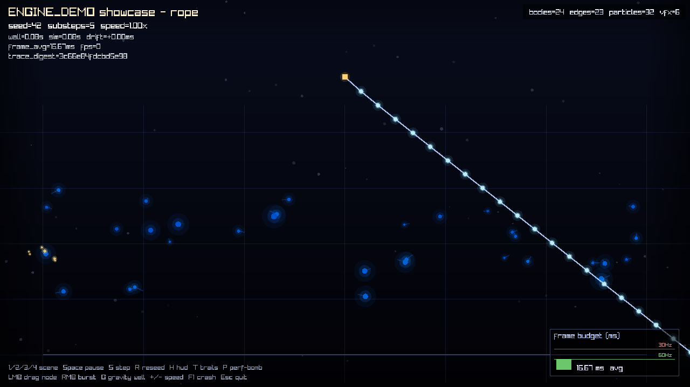
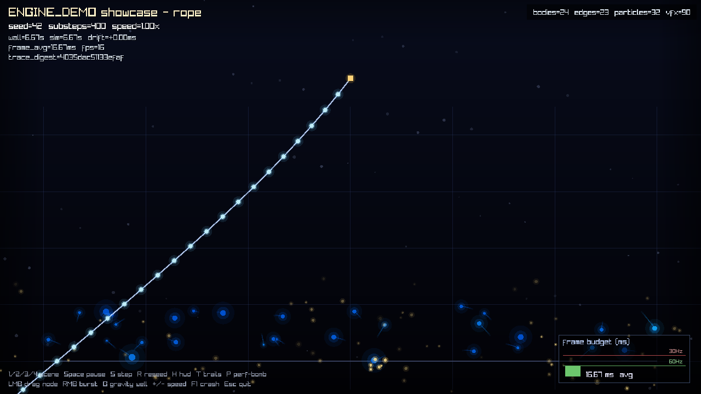

# Visual Verification: Sandbox VFX Visualization

Manual visual verification for Feature 002 (`002-sandbox-vfx-visualization`), captured via
`ea-sandbox.exe --screenshot` on the Windows/VS2022/vcpkg build in this workspace, with the
Mesa llvmpipe software-OpenGL renderer installed (see `/memories/repo/build-windows.md` for
the recipe — this VM has no hardware GPU).

Both screenshots use the same seed (42) and scene (`rope`), differing only in warmup frame
count, to isolate the effect of collision sparks accumulating over time.

## Before — 5 frames (~0.08s of sim time)

HUD reads `vfx=6`: the scene has barely started, free particles are still falling, and only
one faint spark has begun near the bottom-left from an early bounce.

## After — 400 frames (~6.67s of sim time)

HUD reads `vfx=90`: multiple clusters of warm gold/orange spark trails are now visible at
the bottom of the world, exactly where the blue physics particles have been bouncing off
the lower boundary.

## What the comparison shows

- The **existing physics particles** (blue, `particles=32`) and **rope bodies**
  (`bodies=24`, `edges=23`) are identical in both shots — the VFX layer is purely additive
  and never alters physics state, confirming FR-001/FR-004's digest-exclusion guarantee.
- The new **`vfx=` HUD counter** (Feature 002, User Story 3) rises from 6 to 90 as more
  bounces occur over time, then would fall back toward 0 as each spark's 0.6s lifetime
  expires with no further bounces.
- The **warm gold/orange spark bursts** (User Story 2) appear only at contact points on the
  world boundary, layered on top of the unmodified blue particle rendering.
- **`frame_avg`** holds at the fixed 60 FPS budget in both shots, showing the VFX pool
  (2048 capacity) adds no measurable per-frame cost at this population size.
